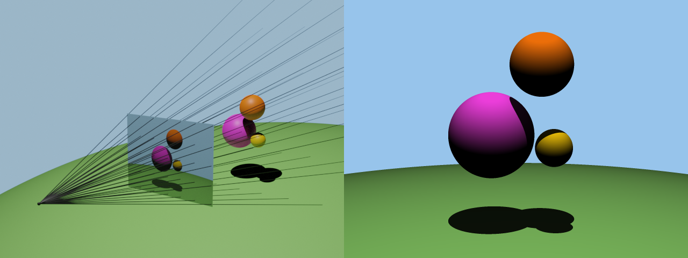

# 3D Ray Tracer

A lightweight 3D ray tracer implemented in C.  
Supports vector math, ray–sphere intersections, Lambertian shading, hard shadows, anti-aliasing, and PPM output.  
Designed as a clean, modular portfolio project.

---

## 📸 Sample Renders

| Example 1 | Example 2 |
|-----------|-----------|
|  |  |

---

## 📑 Index

- [Overview](#overview)
- [Features](#features)
- [Installation](#installation)
- [Usage](#usage)
- [Scene File Format](#scene-file-format)
- [File Structure](#file-structure)
- [Example Results](#example-results)
- [Roadmap](#roadmap)
- [References](#references)

---

## Overview

This project implements a from-scratch ray tracer in C with a small standard library of vector and color utilities. It renders scenes of spheres under a point light with diffuse (Lambertian) shading, optional hard shadows, and 3×3 stratified anti-aliasing. Output images are written as `.ppm` for portability.

---

## Features

- **Vec3 math**: add/sub, dot, cross, normalization, scaling.
- **Ray–sphere intersection**: robust quadratic solve; nearest positive hit.
- **Lambertian shading**: inverse-square light falloff and clamping.
- **Shadows**: shadow ray occlusion with configurable darkening factor.
- **Color system**: HEX → RGB mapping and background color.
- **Anti-aliasing**: 3×3 stratified sampling per pixel (9 spp).
- **PPM writer**: simple plain-text image output.
- **Modular codebase**: clear separation of vector, geometry, color, and main.

---

## Installation

```bash
# Clone
git clone https://github.com/MuhammadZain2005/3D-Ray-Tracer.git
cd 3D-Ray-Tracer

# Build
make
# Executable(s) will be placed in ./bin
```

---

## Usage

```bash
./bin/raytracer <input_scene.txt> <output.ppm>
```
### Example
```bash
./bin/raytracer scenes/example.txt out.ppm
./viewppm out.ppm
```

---

## Scene File Format

Scene description is a simple, line-based text format. The canonical layout:

1. **Image width height**
2. **Viewport height**
3. **Focal length**
4. **Light position (x y z) and brightness**
5. **m** (number of colors)
6. **m lines of HEX colors** (e.g., `#FFAA33`)
7. **Background color index** (0-based into the palette above)
8. **n** (number of spheres)
9. **n lines of spheres**: `cx cy cz radius color_index`

### Notes
- Coordinates are in camera/world space; the camera looks toward −z from the origin.  
- Brightness is a scalar used with inverse-square falloff.  
- Color indices reference the earlier HEX palette.  

---

## File Structure

```
3D-Ray-Tracer/
│
├─ src/                 # Source code
│  ├─ assg.c            # Program entry point + render loop
│  ├─ vector.c/h        # Vec3 math utilities
│  ├─ spheres.c/h       # Sphere primitive + intersection
│  └─ color.c/h         # HEX↔RGB, PPM writer
│
├─ assets/              # Example renders & reference images
├─ *_Testcases/         # Sample inputs/outputs for verification
├─ bin/                 # Build artifacts (executables)
│
├─ Makefile             # Build configuration
├─ viewppm              # PPM viewer
├─ ppmcmp.py            # PPM comparer (visual diff)
└─ README.md
```

---

## Example Results

- **No AA**: Jagged edges along high-contrast boundaries.  
- **3×3 AA**: Noticeably smoother silhouettes and gradients.  
- **Shadows**: Hard contact shadows increase depth and realism.  

Sample images live in `assets/`.

---

## Roadmap

- Multiple lights (point, directional).  
- Specular highlights (Blinn–Phong) and reflections.  
- Additional primitives (planes, triangles) and mesh loading.  
- Acceleration structures (BVH) for performance on complex scenes.  
- Tone mapping and gamma correction.  

---

## References

- Peter Shirley, *Fundamentals of Computer Graphics*  
- Netpbm – PPM Specification  
- Scratchapixel – Ray Tracing Essentials  

